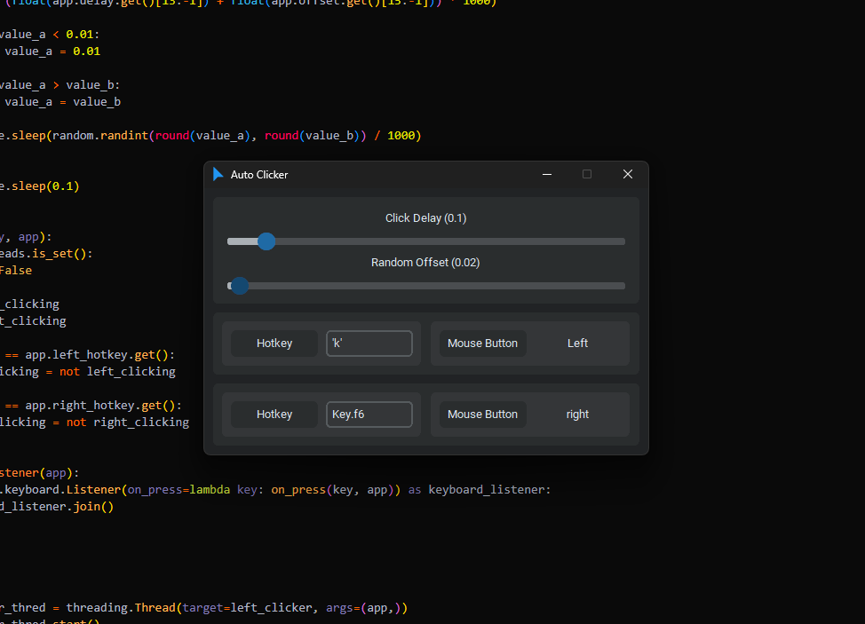

# Auto Clicker

An auto-clicker made with customtkinter.



## Instructions

### Installation

Make sure you have customtkinter installed.

```python
pip install customtkinter # install pygame with pip
```

Make sure you have pynput installed.

```python
pip install pynput # install pygame with pip
```

### How To Use

* Set the click delay to get different times between mouse clickes.
* Set the random offset to give the time between clicks some randomness. If the click delay is 0.4 and the random offset is 0.2, the click delay will be a random number between 0.2 and 0.6 seconds.
* Set a hotkey for each of the different mouse buttons.

### Things To Note

* To set letters, symbols, and numbers to hotkeys, they will need an apostrophe around them. Examples: 'x', '7', and '='.
* Modifier and function Key assignments must begin with the word "Key". Examples: Key.f6, Key.shift, Key.shift_r, Key.ctrl_l, and Key.enter.
* This is an ongoing project that is not finished.
